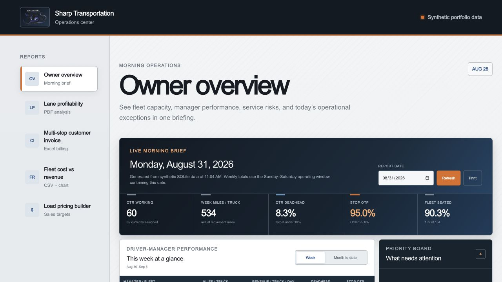
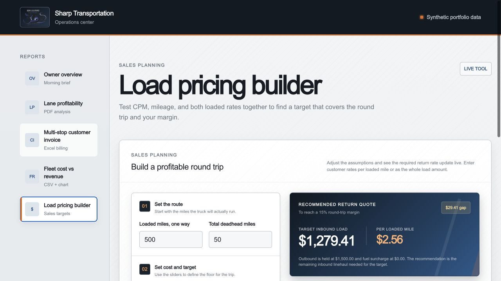
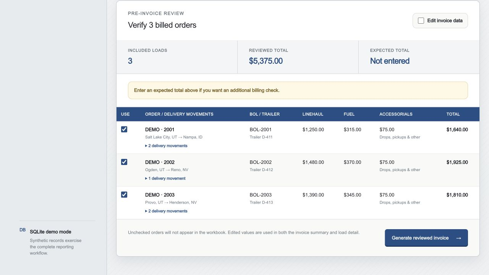

# Sharp Operations Center

[](https://github.com/jadogg22/sharp-operations-center/actions/workflows/ci.yml)

I built this to replace a pile of one-off spreadsheets and reports with one
place where our team can check the operation, review billing, and work through
pricing decisions.

One codebase, two data sources, selected by `DATA_MODE` in the environment:

- `demo` (default) serves a seeded SQLite database with fictional data. A fresh
  clone runs immediately with no configuration, which is how the public
  repository is shared.
- `production` serves the company's read-only Mcloud SQL Server. The
  connection settings and query pack stay out of the repository — see
  [Demo vs production](#demo-vs-production).

## What is in it

The owner overview answers the questions that usually come up first thing in
the morning: How many trucks are working? How much deadhead are we running? Are
we hitting service goals? Where does somebody need to take a closer look?



The rest of the app covers a few jobs that used to take more manual work:

- comparing outbound and inbound lane performance in a PDF;
- reviewing a recurring multi-stop customer's charges before creating an XLSX
  invoice;
- comparing fleet cost with revenue by day, week, or month;
- exporting the numbers as CSV or a chart; and
- testing load rates against miles, deadhead, fuel surcharge, cost per mile,
  and a target margin.

The pricing builder turns those inputs into a return-load target while keeping
the assumptions visible to the person quoting the load.



The billing workflow is deliberately anonymous. The demo shows why it exists—
one bill date can contain several loads, and each load may visit several
delivery locations—without identifying the customer or exposing its freight.



## A note about the demo data

The SQLite database is seeded the first time the backend starts. The names,
routes, orders, equipment counts, and dollar amounts are fictional. They are
there so every screen and export works after a fresh clone.

## Demo vs production

```text
DATA_MODE=demo        DATA_MODE=production
app/db/demo_repository.py   app/db/production_repository.py
        \                        /
         app/db/repository.py  (dispatcher chosen by DATA_MODE)
```

Production mode connects read-only to the Mcloud SQL Server and needs a local
`.env` (never committed) with the connection settings:

   ```bash
   DATA_MODE=production
   SQL_SERVER=...
   SQL_DATABASE=...
   SQL_USER=...
   SQL_PASSWORD=...
   # Real GL accounts for the fleet cost report:
   FLEET_COST_CATEGORIES=51601000:Fleet lease
   # Your Mcloud customer code for the invoice queries:
   CUSTOMER_CODE=...
   ```

   `SQL_DATABASE` also accepts the legacy `SQL_DB` name, so the existing
   go-sharpGraphs environment file works as-is without copying it:

   ```bash
   SHARP_OPERATIONS_ENV_FILE=../go-sharpGraphs/.env DATA_MODE=production \
     uv run uvicorn app.main:app --reload
   ```

The SQL query pack ships in [`sql/`](sql/) and is written to be reusable by
other Mcloud shops — customer codes and GL accounts are configuration, never
hard-coded.

Docker works the same way: put those values in a `.env` beside
`docker-compose.yml` and `docker compose up --build` serves live data; without
them it serves the demo database.

## Run it

The easiest route is Docker:

```bash
cp .env.example .env
docker compose up --build
```

Then open [http://localhost:8080](http://localhost:8080).

For local development, start the API:

```bash
uv sync --extra dev
uv run uvicorn app.main:app --reload
```

Then start the frontend in another terminal:

```bash
cd frontend
npm ci
NEXT_PUBLIC_API_URL=http://localhost:8000/api npm run dev
```

The frontend will be available at [http://localhost:3000](http://localhost:3000).

## How it is put together

```text
Browser
  └── nginx
      ├── React + TypeScript frontend
      └── FastAPI backend
          ├── overview and report services
          ├── PDF, XLSX, CSV, and PNG exporters
          └── repository dispatcher (DATA_MODE)
              ├── SQLite demo database (seeded, fictional)
              └── read-only Mcloud SQL Server (local .env + sql/ pack)
```

The backend is Python 3.12 with FastAPI, pandas, Matplotlib, ReportLab, and
openpyxl. The frontend uses React, TypeScript, and Vinext. GitHub Actions runs
the tests, lint, frontend build, and Docker build on every pull request.

## Checks

```bash
uv run ruff check app tests
uv run pytest
cd frontend && npm run lint && npm run build
```

## License

The code is available under the [MIT License](LICENSE). The Sharp
Transportation logo is included for project context and is not licensed for
reuse.
